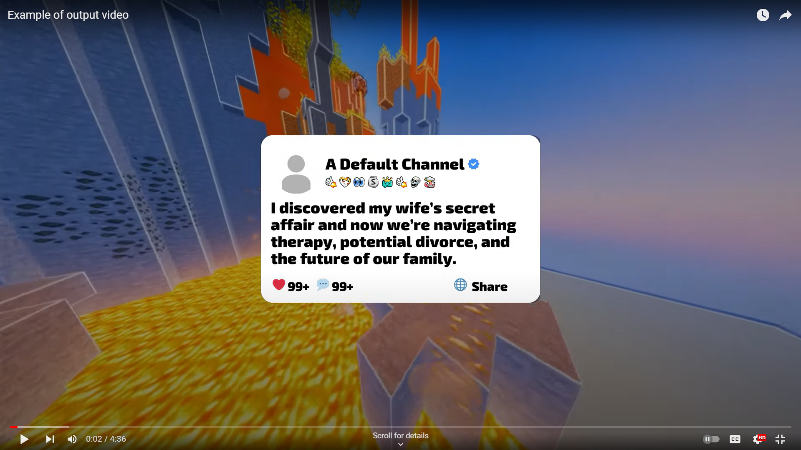

# Reddit-Video-Creator

### You know those Reddit story videos on TikTok? Yeah, this makes those.

**Example:**
- [YouTube Link](https://youtu.be/PZFq4n_LbN0)  
  *(Note: Since this is an example, there is only one story in this video.)*

### Process of Creating These Videos:

1. **Search Stories:**  
   Use Reddit's PRAW API to search specific subreddits for stories of a specific length.
   
2. **Moderate and Grade Stories:**  
   Use GPT-4 to moderate, grade, change names, etc., of the story(s).
   
3. **Order Stories:**  
   GPT then creates an order for these stories to be shown in the video, prioritizing the better stories first.
   
4. **Generate Audio:**  
   Use AWS Polly to break up the stories and convert them into `.wav` audio files.
   
5. **Align Text and Audio:**  
   Use Montreal Forced Aligner (MFA) to align the `.wav` files with the `.txt` file, creating a `.TextGrid` file.
   
6. **Convert to SRT:**  
   Convert the `.TextGrid` file to `.srt` for easier subtitle creation with FFmpeg.
   
7. **Create Intro Cards:**  
   Create an intro card for each story with the title (created by GPT) and use it at the start of the video.
   
8. **Render Each Story:**  
   Render each story separately using FFmpeg.
   
9. **Concatenate Stories:**  
   Finally, concatenate the stories in the order specified by GPT at the start of the process.
   
10. **Repeat Process:**  
    Repeat the process for as many videos as you request.

### Other Things:
1. The process of getting the stories is seperated from the actual video creation due to several factors such as links being present in the story or poor story content. Too prevent this there is some manuel work done but can be set back to automatic if prefferred.
2. There is a lot of unnecessary code throughout the program I know but since this is a personal project I just haven't gotten around to cleaning it up / might use in the future.
3. Feel free to ask any questions regarding the program and how it works. 

### **IMPORTANT**

I have purposefully deleted/edited certain parts of the program, such as GPT prompts, to reduce the likelihood of people just downloading and running the program to make videos. All the core content/logic remains intact. This is to prevent widespread misuse of the program.

---
